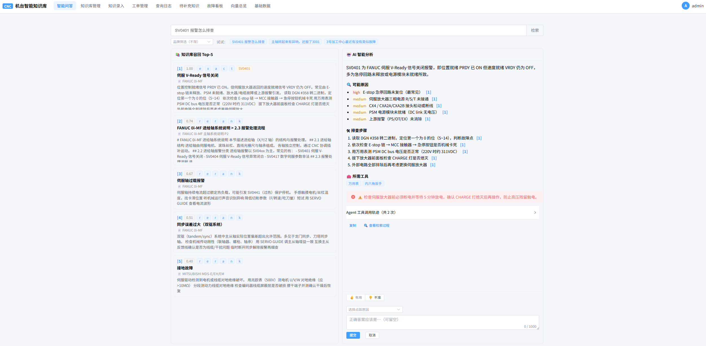
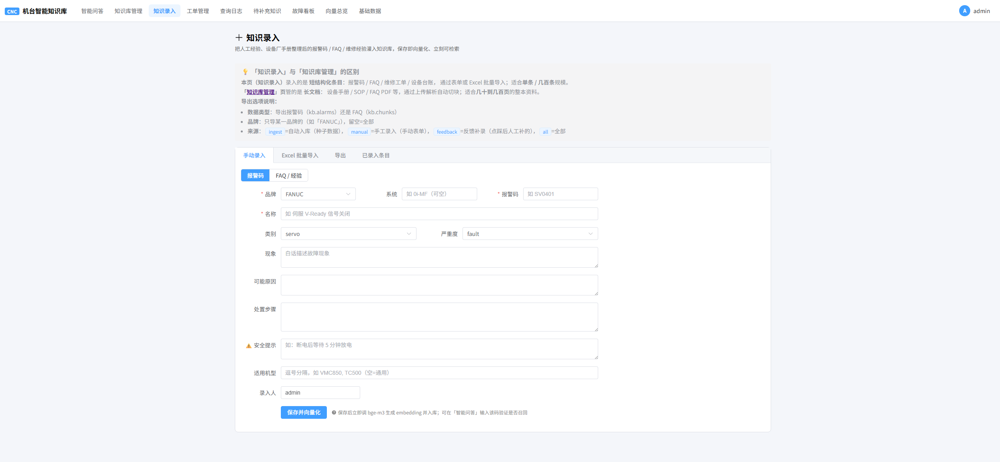
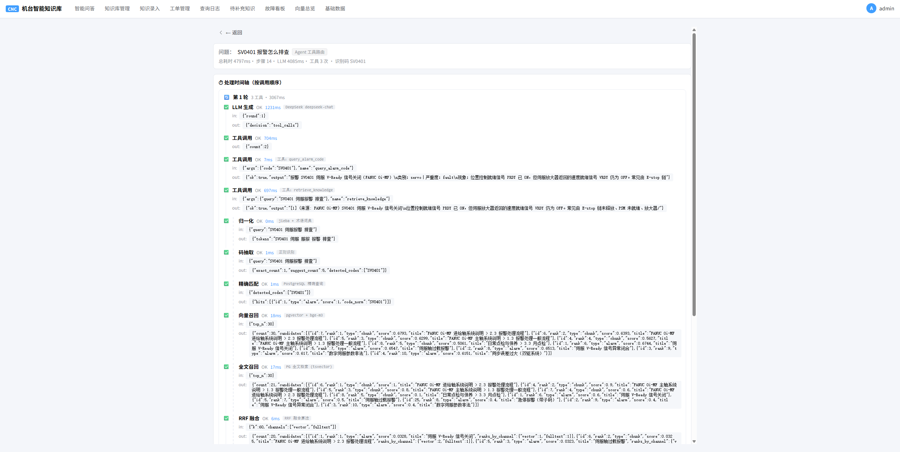
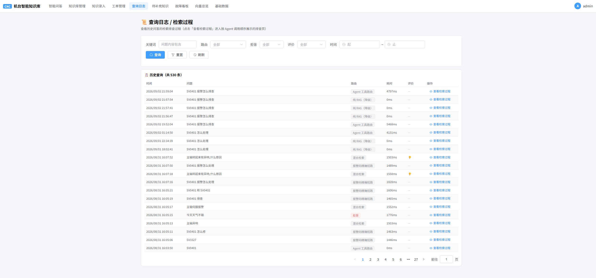
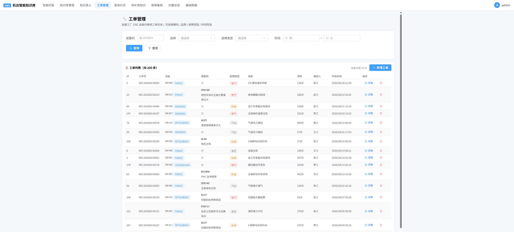
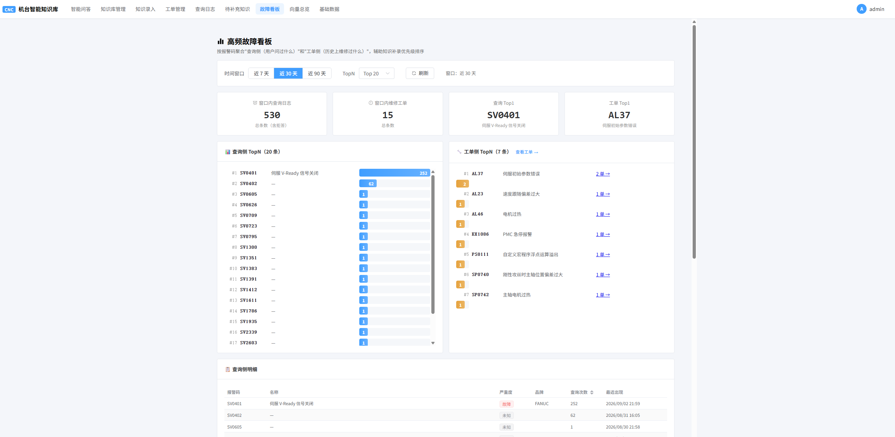
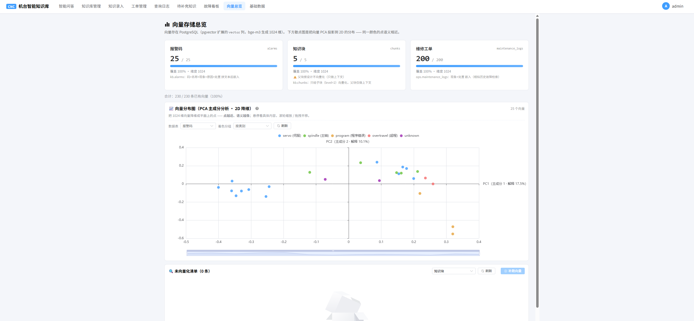

# CNC 机台智能知识库（Python 实现）

面向 **MES / 设备运维** 场景的工业垂直领域 **RAG + Agent** 系统：输入白话故障描述或报警码（如 `SV0401`），左侧返回可溯源的 TopK 原文片段，右侧返回带引用编号的结构化 AI 分析。

> 同一产品另有 **.NET 10 (ASP.NET Core)** 实现：🔗 [`CNC_AgentCore`](https://github.com/gdhAgent/CNC_AgentCore)
> 两版共享同一套 PostgreSQL / pgvector 的 schema 与 API 口径，可对照查看不同技术栈下的实现与部署方式。

---

## 功能特性

| 能力 | 说明 |
|---|---|
| 混合检索 | 向量（bge-m3）+ 中文全文（jieba + tsvector）+ 报警码精确短路 + RRF 融合 + Rerank |
| 引用溯源 | 上下文按 `[n]` 编号注入，LLM 输出每条结论标注来源，后处理剔除越界引用 |
| 抑制幻觉 | 强制引用 + 结构化 JSON 输出 + 拒答门控（召回为空 / 置信度低时不调用 LLM） |
| 数据闭环 | 拒答与差评进入待补充清单 → 补录 → 立即可检索（越用越准） |
| Agent | 显式状态机路由器（`max_rounds=2`），3 个受限工具：检索知识 / 报警码 / 机台历史工单 |
| 前端 | 独立 Vue3 + Vite 仓库，SSE 流式，检索链路时间轴可视化（见下方「前端」） |

> 定位：本系统只做 **检索与辅助分析**，不直接控制机台、不自动下发指令。输出仅供参考，实际作业以厂商手册与现场规程为准（详见文末免责声明）。

## 系统架构

```
前端 (Vue3 + Vite + TS) ── HTTP/SSE ──► FastAPI 后端
                                          ├─ Agent 路由器（状态机，受限工具）
                                          ├─ 检索链路：报警码精确命中 / 向量召回 / 全文召回
                                          │      → RRF 融合 → Rerank → 置信度门控
                                          ├─ LLM (DeepSeek) · Embedding/Rerank (SiliconFlow)
                                          └─ PostgreSQL 17 + pgvector + pg_trgm
                                             ├─ kb  schema：知识（alarms / chunks / documents / term_dict）
                                             ├─ ops schema：业务（machines / maintenance_logs / users / role_permissions）
                                             └─ log schema：运行（query_logs / query_trace_steps / feedbacks / kb_suggestions）
```

- 三个 schema 物理隔离：`kb` 可整库重建（`DROP SCHEMA kb CASCADE`），不影响 `ops` / `log`。
- Provider 抽象：LLM / Embedding / Rerank 均有统一接口，可切换厂商（含内网离线模型）。
- 全链路 Trace：`log.query_trace_steps` 记录 11 类检索步骤，供排查页时间轴与排名对比使用。

## 目录结构

```
CNC_Agent/
├─ app/                     FastAPI 应用源码
│  ├─ main.py               入口（lifespan / 异常 / 限流 / CORS）
│  ├─ config.py             pydantic-settings 读取 .env
│  ├─ core/                 errors / rate_limit / body_limit
│  ├─ db/pool.py + repo/    psycopg 连接池 + 各表数据访问（原生 SQL，无 ORM）
│  ├─ llm/                  base + deepseek + siliconflow + factory
│  ├─ ingest/               loaders / chunker / alarm_parser / pipeline / vectorizer
│  ├─ retrieval/            tokenizer / code_extractor / vector/fulltext search / fusion / reranker / service
│  ├─ agent/                tools / router / prompts / output
│  ├─ api/                  health / query / knowledge / feedback / trace / users / …
│  └─ schemas/              请求 / 响应模型
├─ db/
│  ├─ migrations/           001_extensions.sql … 007_role_permissions_seed.sql（幂等）
│  └─ migrate.py            幂等迁移执行器（自动建库，--status / --reset）
├─ scripts/                 数据种子与工具（load_alarms / seed_users / vectorize_* …）
├─ data/                    报警码种子数据（JSONL，不含任何厂商原始手册）
├─ assets/screenshots/      界面截图（演示后补充）
├─ Dockerfile / docker-compose.yml / entrypoint.sh / DOCKER.md    容器化部署
├─ requirements.txt / pyproject.toml
└─ .env.example / .env.docker.example   配置模板（无真实密钥）
```

## 快速开始

推荐使用 Docker（一条命令起 `PostgreSQL+pgvector` 与后端）；需要真实问答时填入 API Key。

### 方式一：Docker（推荐，含 Windows）

```bash
# 0) 需要本机 Docker
cp .env.docker.example .env.docker          # 填入 PG_SUPERPASSWORD / API Key / JWT_SECRET
docker compose --env-file .env.docker up -d --build
curl http://localhost:8000/health
```

- 首次默认只建 schema（表 + 基础数据）。想顺带灌演示报警与演示账号，把 `.env.docker` 的 `RUN_SEEDS` 设为 `1` 再起。
- 详细命令、登录账号与停止方式见 [`DOCKER.md`](DOCKER.md)。

### 方式二：本地运行（Linux / macOS）

依赖：Python 3.12、PostgreSQL 17 + pgvector（扩展见 `db/migrations/001_extensions.sql`）。

```bash
cp .env.example .env                        # 填 PG_SUPERPASSWORD / DEEPSEEK_API_KEY / SILICONFLOW_API_KEY
python3 -m venv .venv && source .venv/bin/activate
pip install -r requirements.txt

python db/migrate.py                        # 首次自动建库 cnc_kb
python scripts/load_alarms.py               # 报警码种子
python scripts/vectorize_alarms.py          # 向量化（需 SiliconFlow Key，可后续再跑）
python scripts/seed_users.py                # 演示账号
python scripts/seed_machines.py --clear && python scripts/seed_maintenance.py --clear
python scripts/vectorize_maintenance.py

uvicorn app.main:app --host 0.0.0.0 --port 8000
```

> Windows 原生运行会遇到 Python asyncio 在 Windows 的事件循环差异，建议直接用上方 Docker 方式，避免额外配置。

健康检查：`GET /health` 返回 db / llm / embedding / rerank 四项状态。

## 前端

UI 是独立的 Vue3 + Vite 项目（`CNC_Web_Agent`，将与本项目同期开源）。在前端仓库根目录：

```bash
npm install
npm run dev        # http://localhost:5173 ，/api 代理到后端 8000
```

## 界面截图

> 以下截图来自本地演示环境（Vue3 前端 + PostgreSQL 演示数据）。

#### 智能问答（主界面：左右分栏 + 流式）


#### 知识库管理


#### 知识录入


#### 检索链路（时间轴 + 多路排名）


#### 日志查询


#### 工单管理


#### 故障看板


#### 向量看板


## 配置项

| 组 | 键 | 说明 |
|---|---|---|
| 数据库 | `PG_HOST / PG_PORT / PG_SUPERUSER / PG_SUPERPASSWORD / PG_DB` | 连接 PostgreSQL（cnc_kb） |
| LLM | `DEEPSEEK_API_KEY / DEEPSEEK_BASE_URL / DEEPSEEK_MODEL` | 问答模型（OpenAI 兼容） |
| 检索 | `SILICONFLOW_API_KEY / SILICONFLOW_BASE_URL`、`EMBEDDING_MODEL / EMBEDDING_DIM / RERANK_MODEL`、`RERANK_THRESHOLD` | 向量化与重排 |
| 鉴权 | `JWT_SECRET / JWT_ALGORITHM / JWT_TTL_SEC / JWT_ISSUER`、`PBKDF2_ITERATIONS` | 登录与令牌 |
| 保护 | `RATE_LIMIT_MAX / RATE_LIMIT_WINDOW_SEC / MAX_BODY_BYTES / QUERY_TIMEOUT_SEC` | 运行保护 |

## 数据与免责声明

- **报警码数据**整理自厂商公开技术文档与公开维修资料（不包含任何厂商原始手册 PDF 文件），仅供学习与技术演示，不用于商业用途；如有权利异议请联系移除。
- **设备台账与维修工单**为脚本生成的仿真数据（库中以 `is_demo = true` 标记），不含任何真实企业信息。
- 本系统为**故障检索与辅助分析工具**，输出仅供参考，**不可作为机床操作、维修或安全决策的唯一依据**，实际作业请遵循设备厂商官方手册与工厂安全规程。
- 真实 API Key 一律放在本机 `.env`（已被 `.gitignore` 忽略），仓库内只提供占位模板。

## Roadmap

- [x] 混合检索 / Agent / SSE 流式 / 评估闭环（当前版本）
- [x] .NET 10 复刻版（见 [`CNC_AgentCore`](https://github.com/gdhAgent/CNC_AgentCore)）
- [ ] 界面截图与演示素材补充
- [ ] 离线模型（Ollama 等）部署支持
